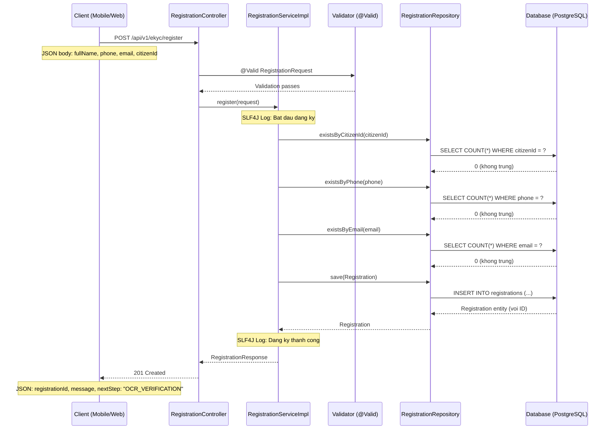

# Architecture Diagram - Hệ thống eKYC
## Luồng Client -> Controller -> Service -> Database



## Sơ đồ kiến trúc tổng thể (Component Diagram)

```mermaid
graph TB
    subgraph "Client"
        MobileApp[Mobile App]
    end

    subgraph "Spring Boot Application"
        Controller[RegistrationController<br/>REST API]
        Service[RegistrationService<br/>Business Logic]
        Repo[RegistrationRepository<br/>JPA Data]
        Validation[Validation Layer<br/>Custom Validators]
        GlobalHandler[GlobalExceptionHandler<br/>@RestControllerAdvice]
    end

    subgraph "Data Layer"
        DB[(PostgreSQL<br/>Hồ sơ đăng ký)]
    end

    subgraph "Cross-Cutting"
        Log[SLF4J Logging]
    end

    MobileApp -->|HTTP Request| Controller
    Controller --> Validation
    Controller --> Service
    Service --> Repo
    Repo --> DB
    Service --> Log
    Controller --> GlobalHandler
    GlobalHandler -->|Error Response| MobileApp
    Controller -->|Success Response| MobileApp
```

## Package Structure

```
com.abcbank.ekyc
├── controller/
│   └── RegistrationController.java      # REST API endpoint
├── dto/
│   ├── RegistrationRequest.java         # Request DTO (input)
│   ├── RegistrationResponse.java        # Response DTO (output)
│   └── ErrorResponse.java              # Error DTO chuẩn
├── entity/
│   ├── Registration.java               # JPA Entity
│   └── RegistrationStatus.java         # Enum trạng thái
├── exception/
│   ├── DuplicateResourceException.java  # Lỗi trùng lặp
│   ├── BusinessException.java           # Lỗi nghiệp vụ
│   └── GlobalExceptionHandler.java      # Xử lý exception tập trung
├── repository/
│   └── RegistrationRepository.java     # Spring Data JPA
├── service/
│   ├── RegistrationService.java         # Interface
│   └── impl/
│       └── RegistrationServiceImpl.java # Implementation
└── validator/
    ├── ValidCitizenId.java              # Annotation custom
    ├── CitizenIdValidator.java          # Validator CCCD 12 số
    ├── ValidVietnamesePhone.java        # Annotation custom
    └── VietnamesePhoneValidator.java    # Validator SĐT VN
```
